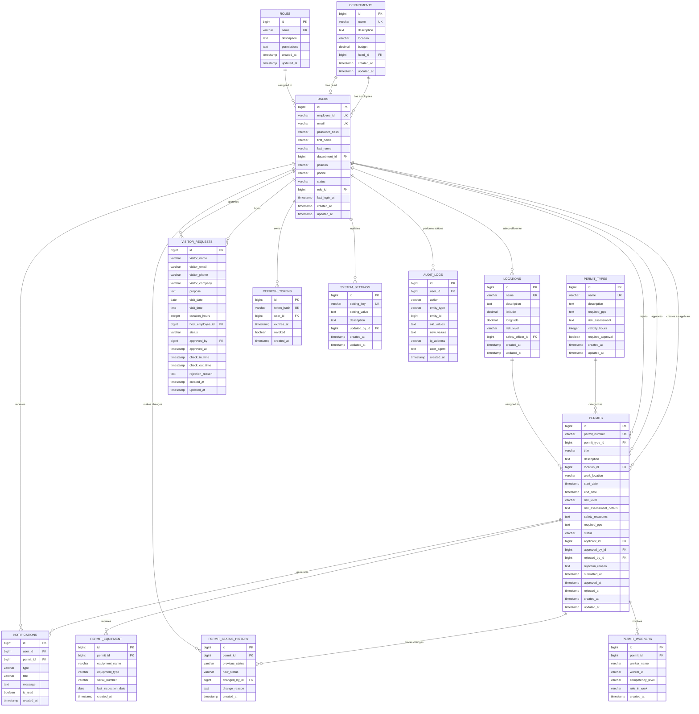

# CPSMS Database ER Diagram

## Entity Relationship Diagram for Hindalco CPSMS

## Database Statistics

### **Table Count**: 14 core tables
### **Entity Distribution**:
- **Master Data**: 4 tables (departments, roles, locations, permit_types)
- **User Management**: 2 tables (users, refresh_tokens)
- **Permit Management**: 5 tables (permits, permit_status_history, permit_equipment, permit_workers, notifications)
- **Visitor Management**: 1 table (visitor_requests)
- **System Management**: 2 tables (system_settings, audit_logs)

### **Relationship Cardinality**:
- **One-to-Many**: 13 relationships
- **One-to-One**: 2 relationships (department head, location safety officer)

### **Key Features**:
- ✅ **Referential Integrity**: All foreign keys properly defined
- ✅ **Audit Trail**: Complete change tracking via audit_logs and permit_status_history
- ✅ **Hierarchical Structure**: Department heads, role-based permissions
- ✅ **Comprehensive Tracking**: Equipment, workers, status changes
- ✅ **Security**: JWT token management, user authentication
- ✅ **Notifications**: Event-driven notification system

## Entity Descriptions

### **Core Business Entities**

#### **DEPARTMENTS**
- Represents 23 plant departments
- Has hierarchical structure with department heads
- Tracks budget and location information

#### **USERS**
- 155+ employees across all departments
- Role-based access control
- Department association for organizational structure

#### **PERMITS**
- Work permit applications and approvals
- Complete workflow tracking (draft → submitted → approved/rejected)
- Links to locations, permit types, and involved personnel

#### **LOCATIONS**
- 10 plant locations with GPS coordinates
- Risk level classification (LOW/MEDIUM/HIGH/CRITICAL)
- Assigned safety officers

### **Support Entities**

#### **PERMIT_TYPES**
- 8 types of work permits
- PPE requirements and validity periods
- Risk assessment templates

#### **NOTIFICATIONS**
- Event-driven messaging system
- Links users to permit-related events
- Read/unread status tracking

#### **VISITOR_REQUESTS**
- External visitor management
- Host employee assignment
- Check-in/check-out tracking

### **Audit & Tracking Entities**

#### **PERMIT_STATUS_HISTORY**
- Complete audit trail for permit changes
- Tracks who changed what and when
- Reason codes for changes

#### **AUDIT_LOGS**
- System-wide audit logging
- User action tracking
- Data change history

#### **SYSTEM_SETTINGS**
- Configurable system parameters
- Admin-controlled settings
- Change tracking

## Key Relationships Explained

### **1. Department Structure**
- Users belong to departments (users.department_id → departments.id)
- Departments have heads (departments.head_id → users.id)
- Creates organizational hierarchy

### **2. Role-Based Access**
- Users have roles (users.role_id → roles.id)
- Roles define permissions for system access
- Supports hierarchical permission model

### **3. Permit Workflow**
- Users create permits (permits.applicant_id → users.id)
- Users approve/reject permits (permits.approved_by_id/rejected_by_id → users.id)
- Permits belong to types and locations

### **4. Safety Management**
- Locations have safety officers (locations.safety_officer_id → users.id)
- Permits require safety assessments
- Equipment and worker tracking for safety compliance

### **5. Audit & Compliance**
- All permit changes tracked in permit_status_history
- System actions logged in audit_logs
- Complete traceability for compliance

This ER diagram represents a comprehensive safety management system designed for industrial operations with proper separation of concerns, audit capabilities, and role-based security.
